# DataPlotly
DataPlotly plugins allows to create  interactive like
plots thanks to the  library and the python API.

DataPlotly makes plot creation and customization easy for every needs.

Besides all the plot and customizations available, the plot is **linked** with
the map canvas:

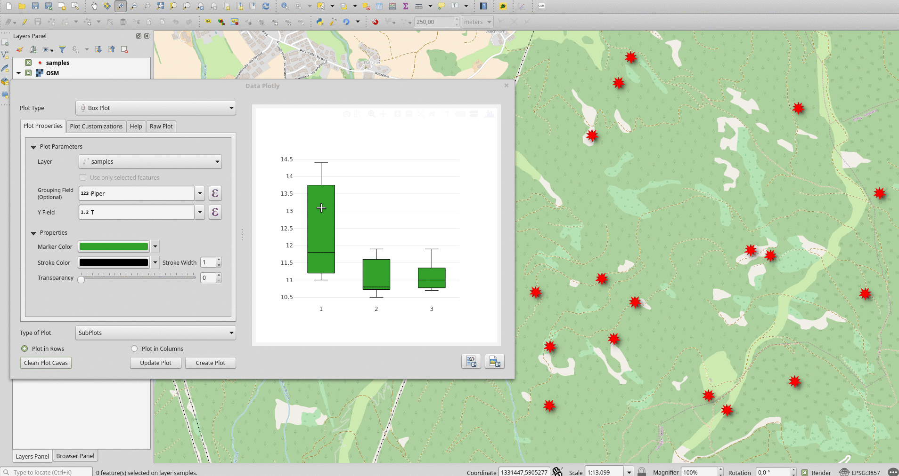

## Usage
DataPlotly works **only with QGIS 3** (or current QGIS dev). No additional
libraries are necessary.

## Gallery

### Single Plot

Some examples of single plot type with some options. The list is far away to show all the possibilities.

#### Scatter Plot
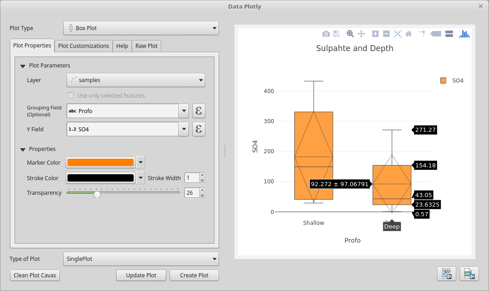

#### Box Plot with statistics

#### Stacked Bar Plot
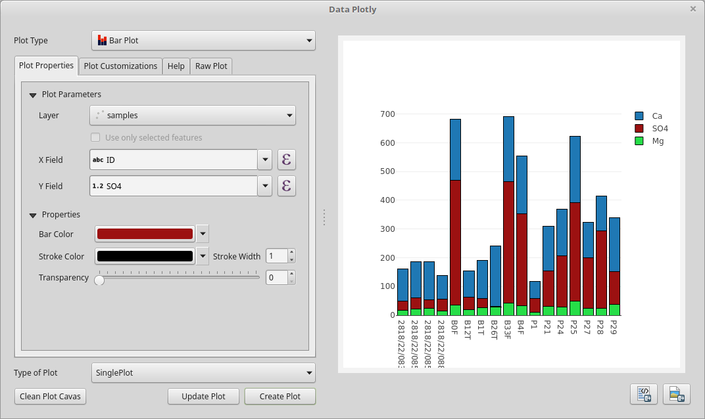

#### Probability Histogram
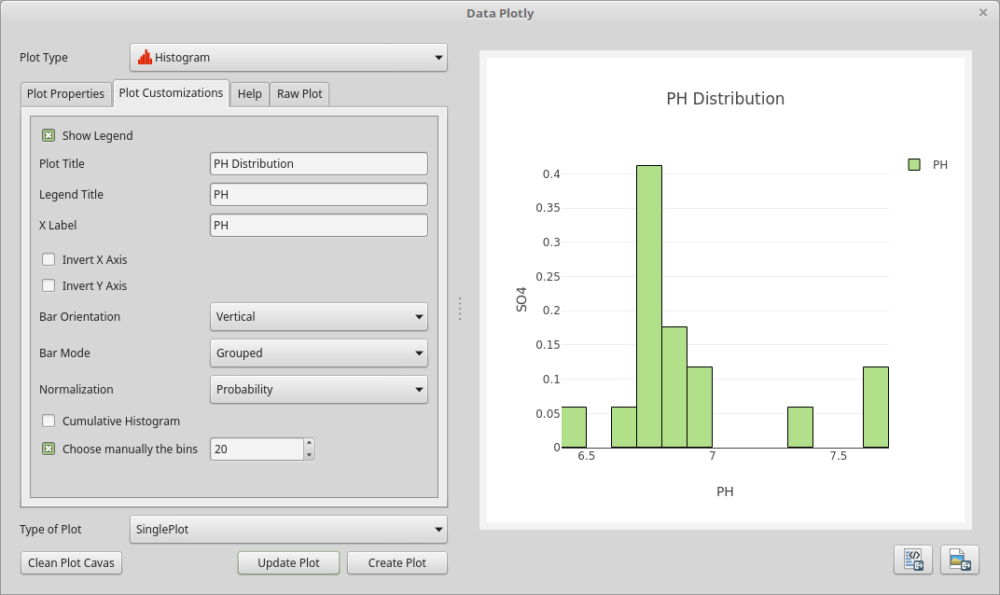

#### Pie Chart
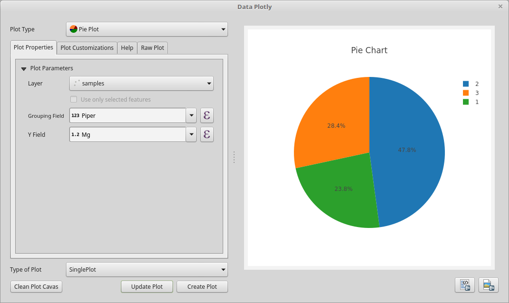

#### 2D Histogram
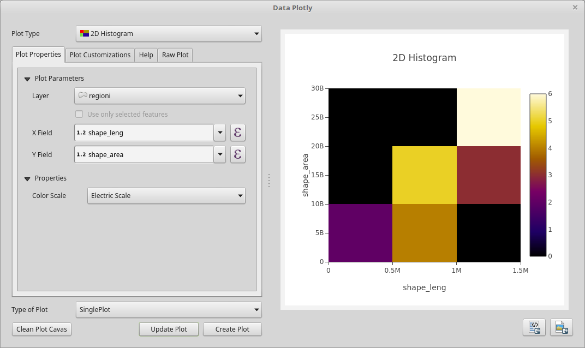

#### Polar Plot
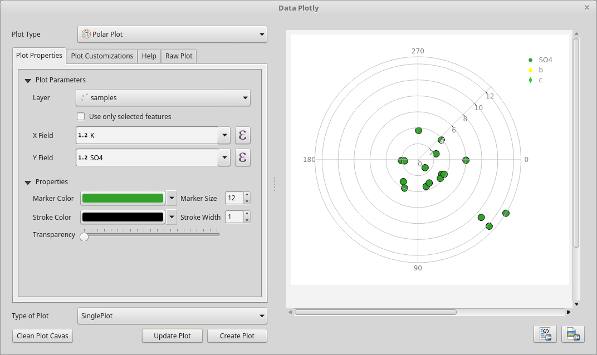

#### Ternary Plot
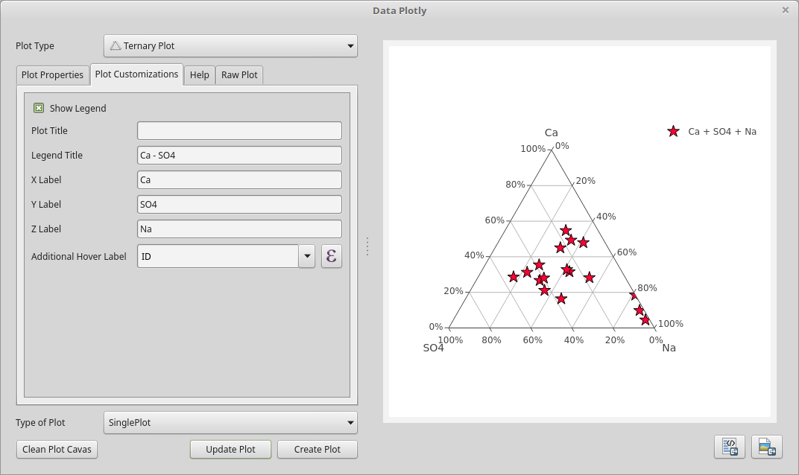

#### Contour Plot with fire color scale
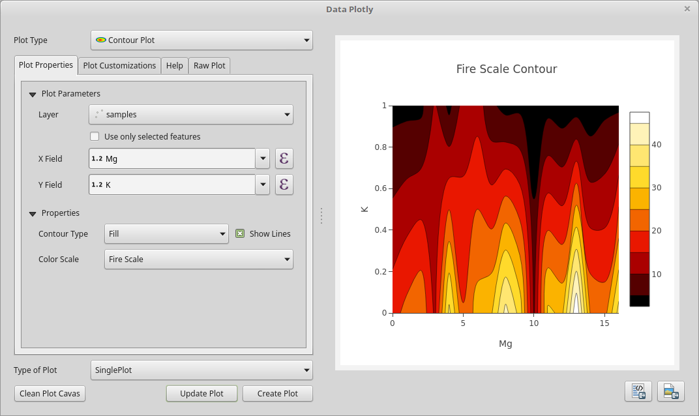

### Multi Plots
DataPloty allows to create different plot type in the same *plot canvas* but allow also the chance to separate each plot in a different canvas.

<aside class="warning">
Some plot are not compatibles with overlapping or subplotting. A message will warn you when this happens.
</aside>

## Overlapped Plots
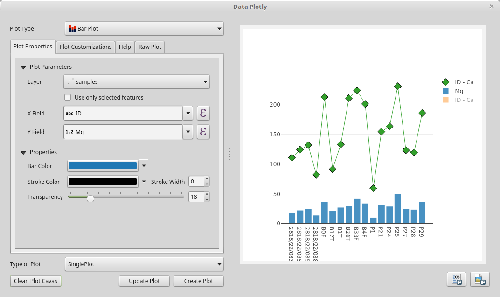

## Subplots in row
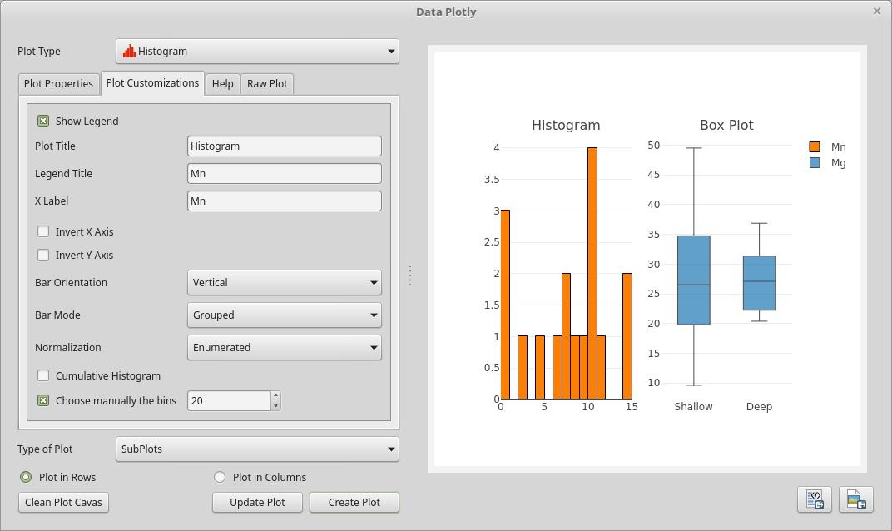

## Subplots in column
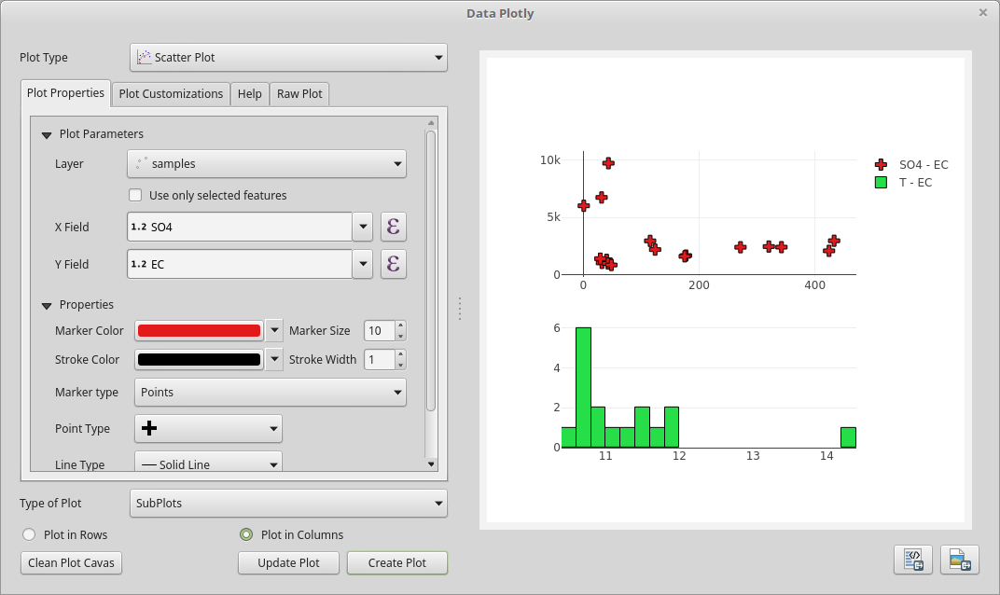
