# DataPlotly

The DataPlotly plugin allows creation of [D3](https://d3js.org/)-like
interactive plots directly within QGIS, thanks to the [Plotly](https://plot.ly/python/)
library and its Python API.

DataPlotly makes plot creation and customization easy for every needs.

Besides all the plot and customization available, the plot is **linked** with
the QGIS map canvas:

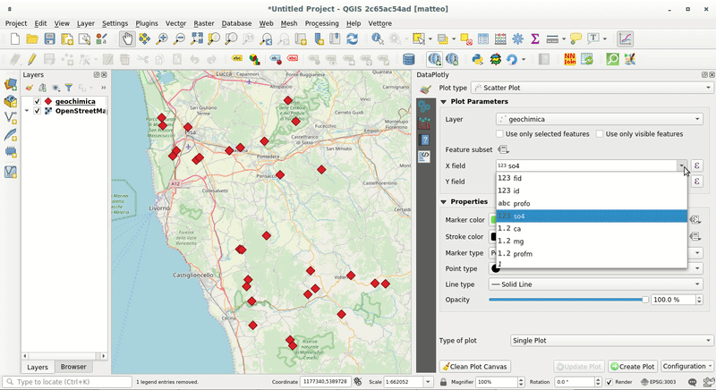

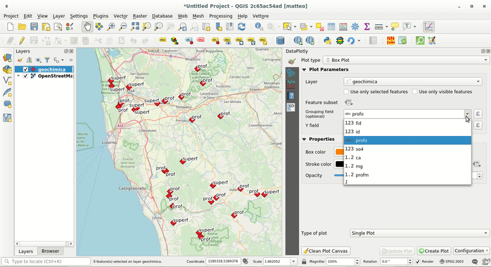

## Usage
DataPlotly works **only with QGIS 3**. No additional libraries are necessary.

## Gallery

### Single Plot

Some examples of single plot type with some options. The list is far away to show all the possibilities.

#### Scatter Plot
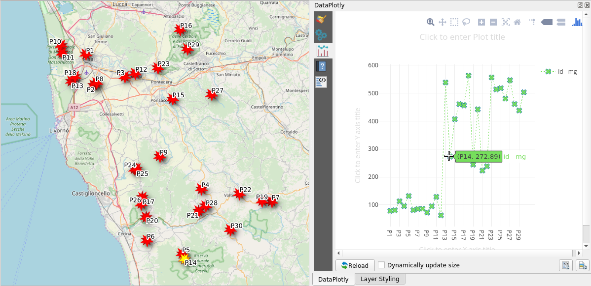

#### Box Plot with statistics
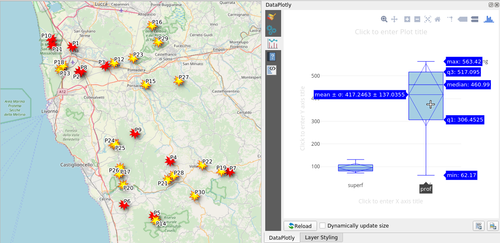

#### Violin Plot
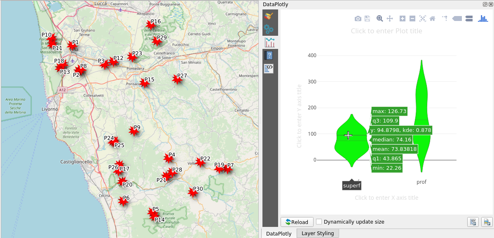

#### Stacked Bar Plot
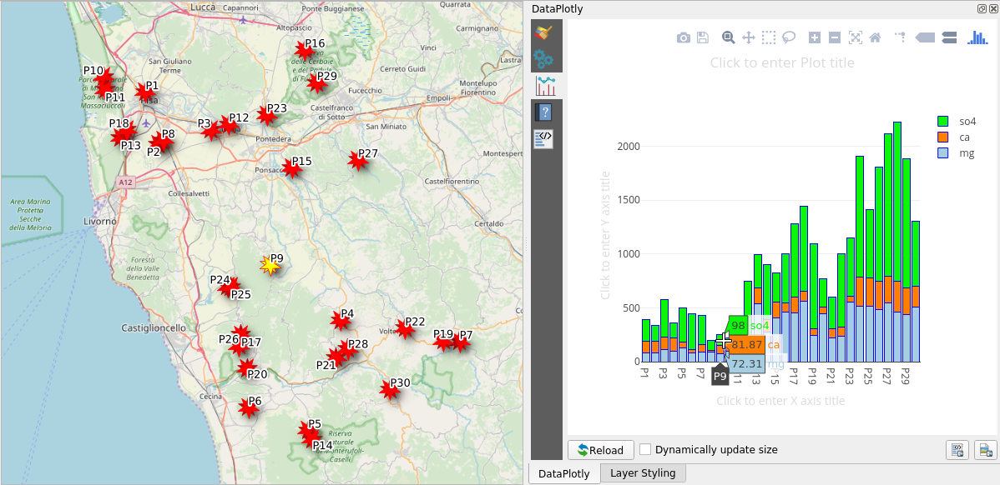

#### Probability Histogram
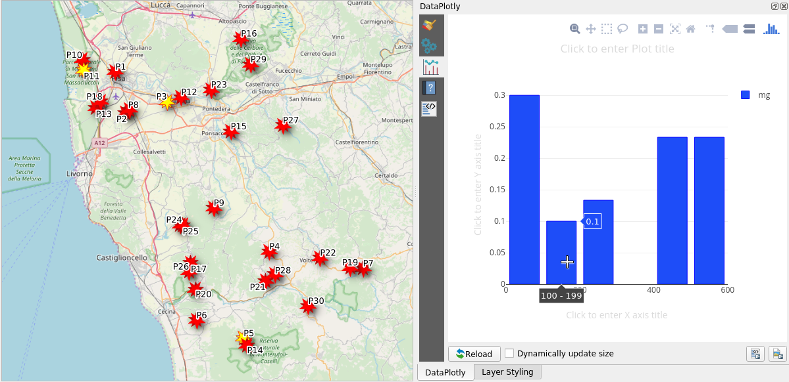

#### Pie Chart
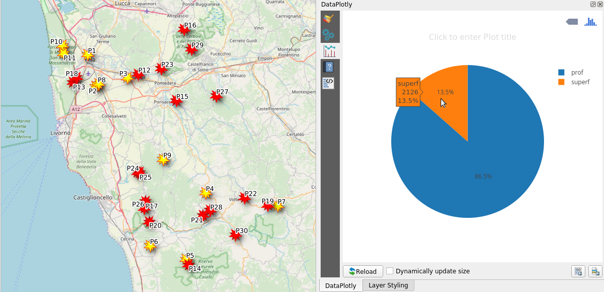

#### 2D Histogram
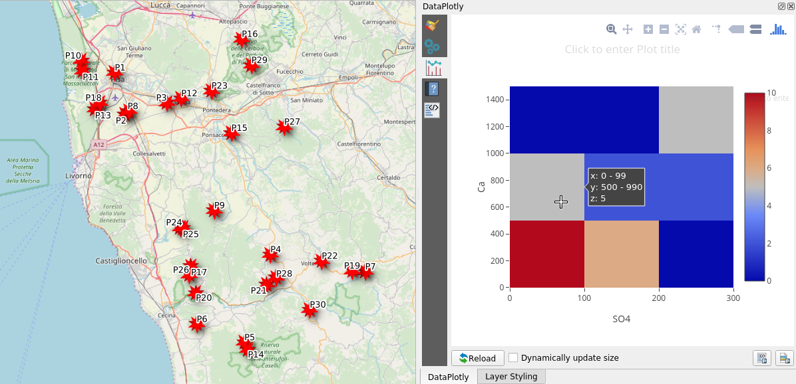

#### Polar Plot
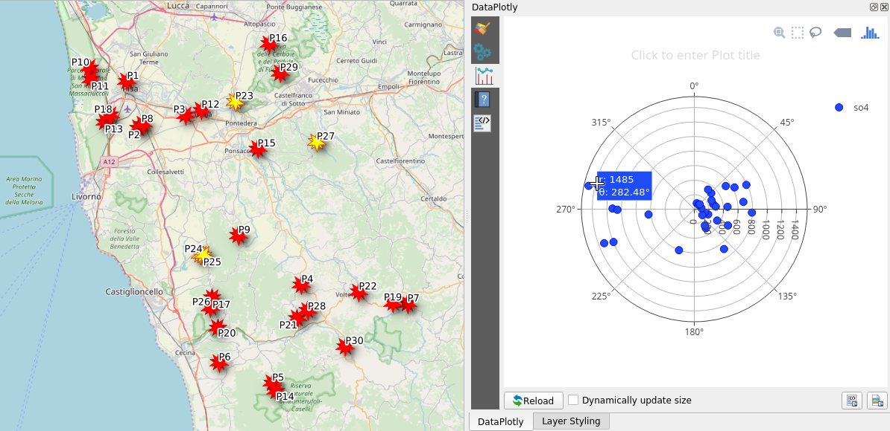

#### Ternary Plot
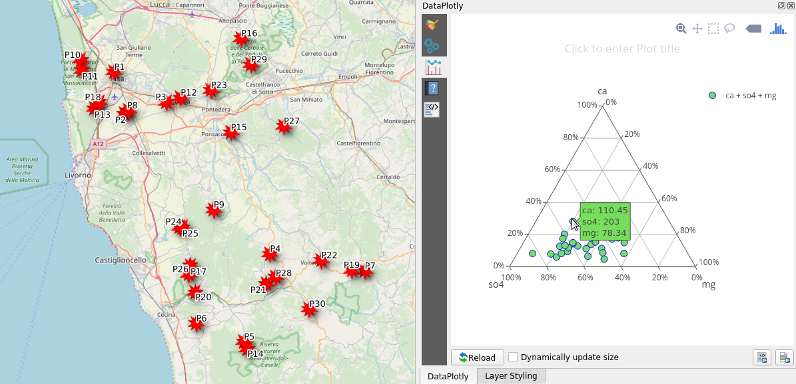

#### Contour Plot
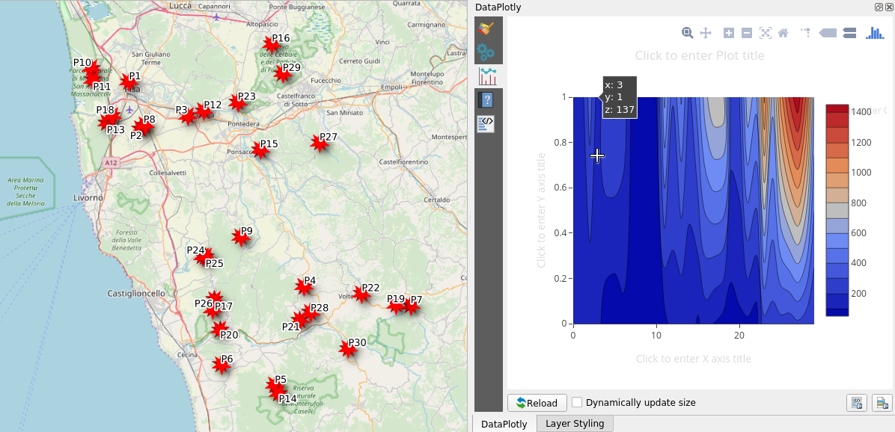

### Multi Plots
DataPloty allows creation of different plot type in the same *plot canvas* but also allows the chance to separate each plot in a different canvas.

<aside class="warning">
Some plot are not compatible with overlapping or subplotting. A message will warn you when this happens.
</aside>

## Overlapped Plots
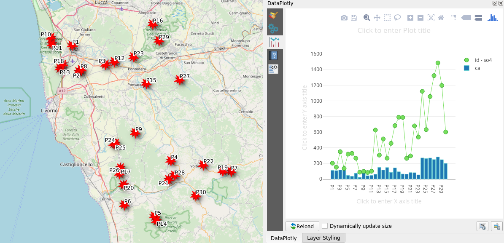

## Subplots in row
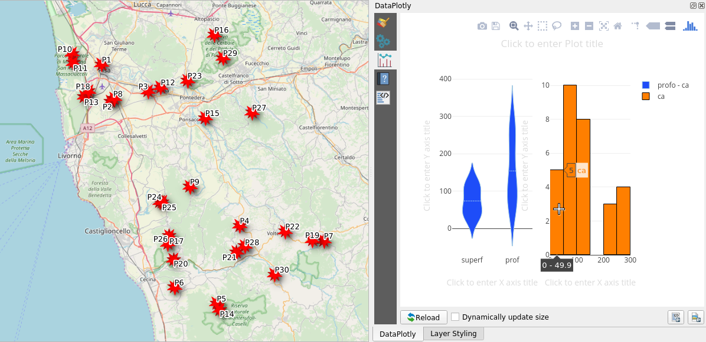

## Subplots in column
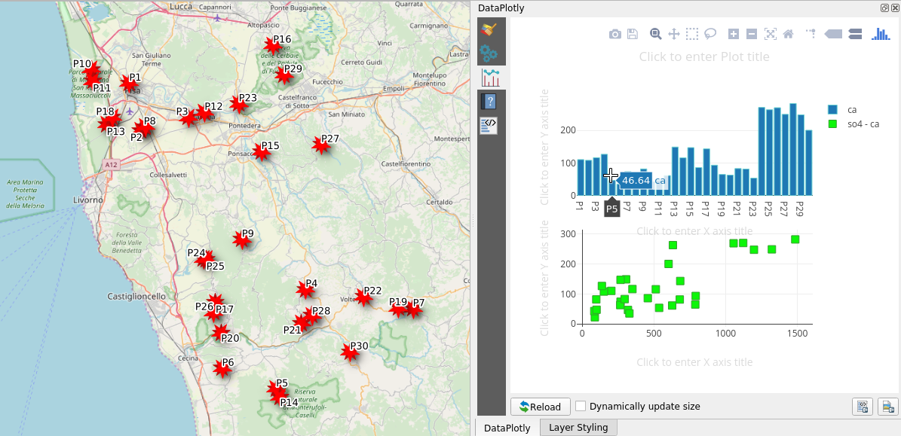
